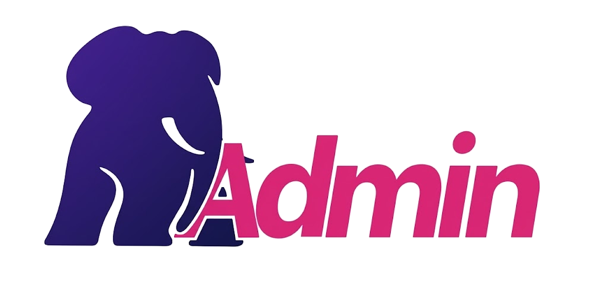
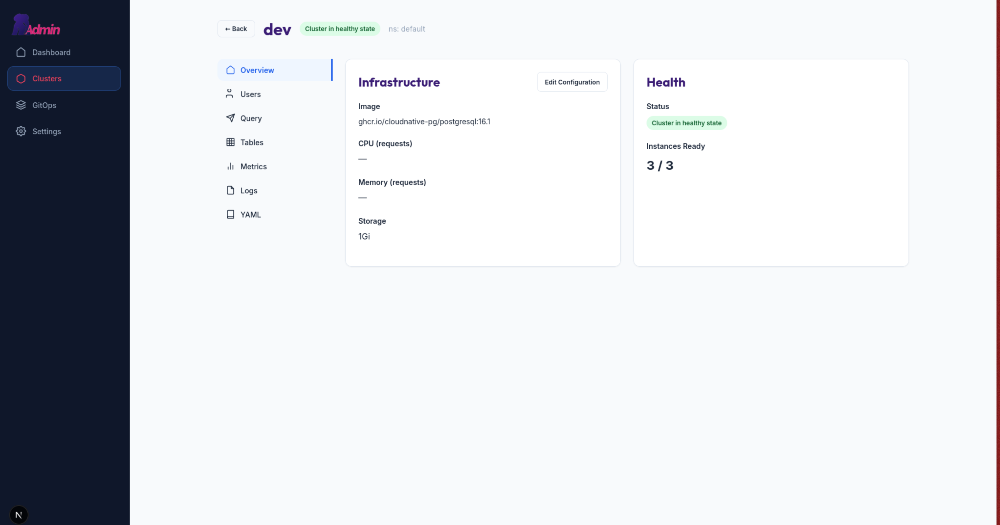
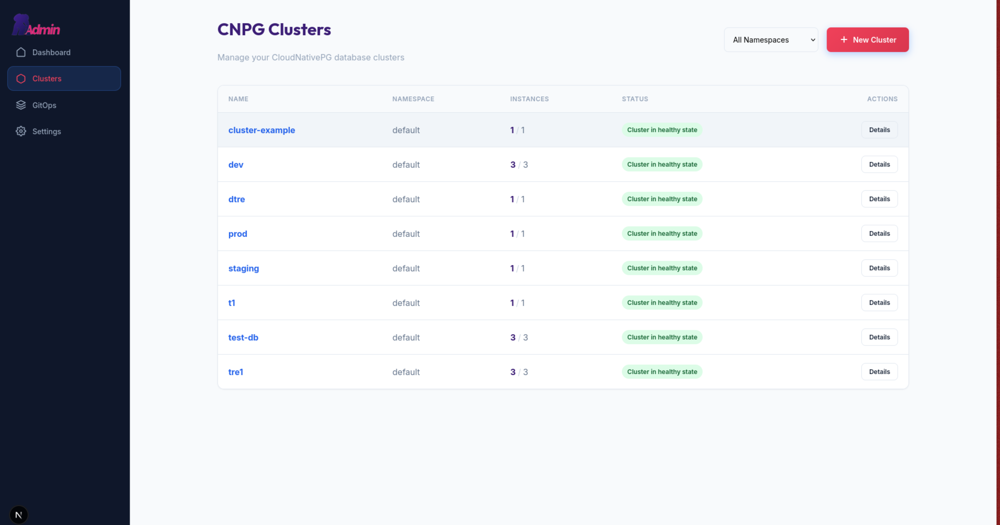
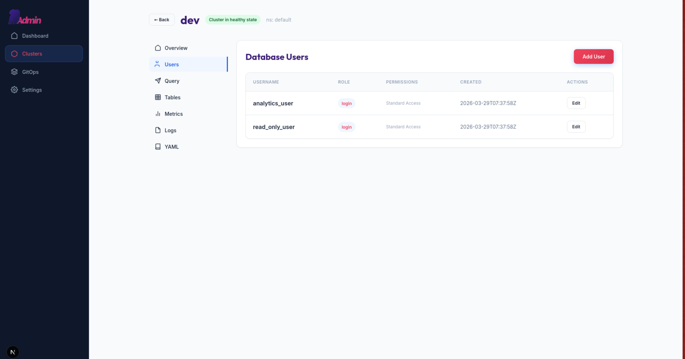
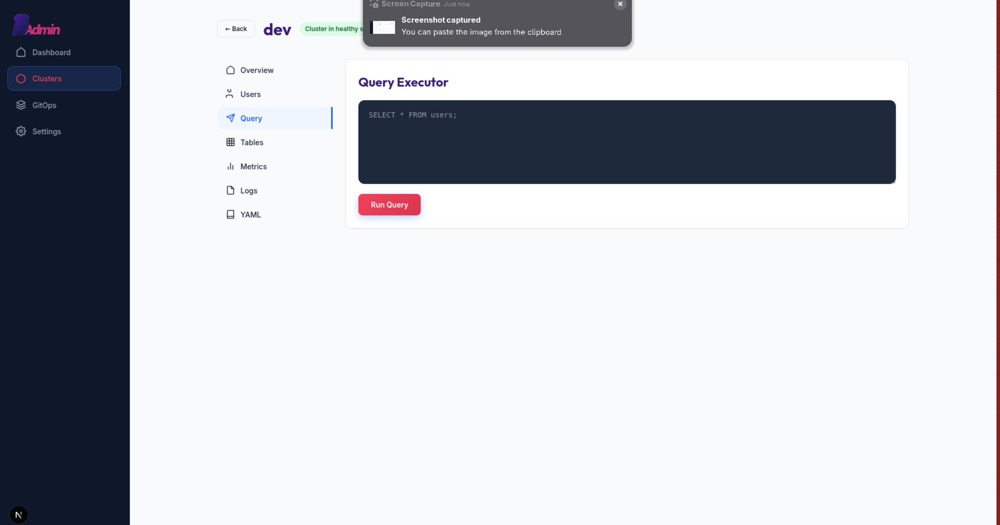
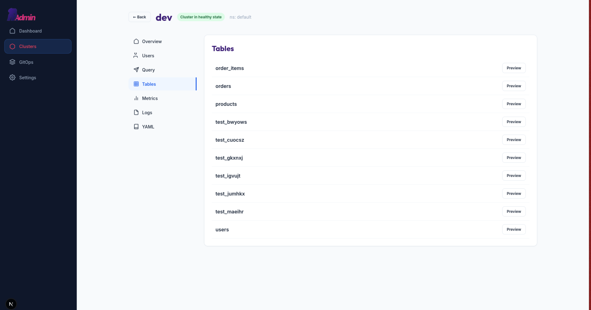
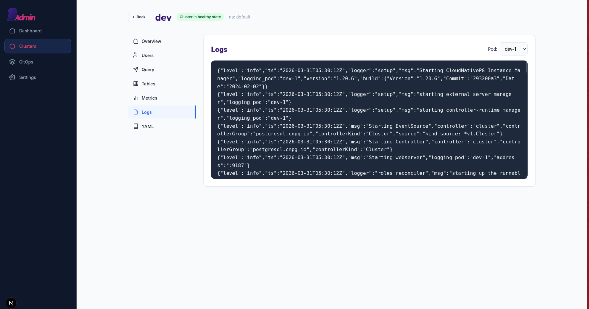

# 🐘 CNPG Admin



** LLMS were used in the creation of this project **

### The missing UI for CloudNativePG (PostgreSQL Operator for Kubernetes)

**CNPG Admin** is a an, enterprise-focused web interface designed to manage [CloudNativePG](https://cloudnative-pg.io/) clusters. While the operator provides powerful automation through CRDs and `kubectl`, CNPG Admin bridges the gap for **DBAs and Developers** who need a visual, intuitive way to manage database lifecycles without mastering the nuances of DevOps tooling.



---

## 🚀 Key Features

### 🛠️ Cluster Management
- **Full Lifecycle**: Create, scale, and delete PostgreSQL clusters directly from a sleek UI.
- **Visual Status**: Real-time health monitoring of instances, replicas, and storage.
- **Resource Management**: Configure CPU, Memory, and Storage requests/limits with interactive forms.



### 👤 User & Role Management
- **Database Users**: Create and manage PostgreSQL users and their credentials.
- **RBAC**: Configure roles and permissions directly from the interface.



### 🔍 Query & Data Exploration
- **SQL Editor**: Execute queries against your clusters with a built-in editor.
- **Table Browser**: Explore schemas and preview table data without leaving the browser.
- **Query Statistics (WIP)**: Integrated query analytics and slow query logs for performance tuning.




### 🔄 GitOps & Drift Reconciliation
- **Bidirectional Sync**: Bi-directional synchronization between the UI and your Git repository.
- **Drift Detection & Automatic Reconciliation**: Automatic detection of state differences between Kubernetes and your GitOps source of truth with visual alerts of any "Drift". 
- **PR-Based Workflow**: Native support for Pull Request-based proposals. Changes made in the UI can generate PRs for auditing before being applied to the cluster.

### 📊 Observability (WIP)
- **Metrics Dashboard**: Native integration with PostgreSQL metrics (connection counts, storage usage, cache hit ratios).
- **Log Streaming**: Real-time access to Pod and PostgreSQL logs for rapid debugging.



---

## 🛡️ The Enterprise "Why"

In the open-source world, there is a distinct lack of "operator-aware" management UIs. Most tools are either generic Kubernetes dashboards (like Lens) or database-agnostic SQL clients (like DBeaver). 

**The result?** Almost every enterprise building on K8s operators ends up reinventing the wheel—building custom internal scripts or side-portals to allow their DBAs to scale a cluster or create a user without needing `cluster-admin` RBAC or deep YAML knowledge.

**CNPG Admin is designed to be that standard wheel.**

- **Air-Gapped Ready**: Zero external JS dependencies. Everything is bundled for secure, offline environments. (WIP)
- **Minimal Overhead**: Lightweight architecture designed to run as a single pod within the `cnpg-system` namespace.
- **RBAC Focused**: Inherits Kubernetes native security, ensuring users only see what they are authorized to manage.

---

## 🏗️ Technical Stack

- **Frontend**: Next.js (React 19) with a responsive design system.
- **Backend API**: Next.js API Routes interacting with the Kubernetes API via `@kubernetes/client-node`.
- **GitOps Engine**: Powered by `isomorphic-git` for Git synchronization 
- **Database Connectivity**: Native `pg` client for direct query execution and metadata extraction.

---

## 🚦 Getting Started

### Prerequisites
- A Kubernetes cluster with the **CloudNativePG operator** installed.
- `kubectl` configured with access to the cluster.

### Fast Development (Local)
```bash
# Install dependencies
npm install

# Run the development server
npm run dev
```

### Dev in K8s Environment

Install `mirrord` - https://metalbear.com/mirrord/docs/getting-started/quick-start
This will run the process as if it was running inside a pod, and you can develop the kube native way easily.

```
kubectl apply -f deploy/mirrord-target.yaml
mirrord exec --config ./mirrord.json -- npm run dev
```

### Deploying to Kubernetes
CNPG Admin is designed to run within the `cnpg-system` namespace to share the operator's context.

```bash
# Build the production image
docker build -t cnpg-admin:latest .

# Apply the manifests
kubectl apply -f deploy/manifests.yaml
```

---

## 🗺️ Roadmap & WIP
- [ ] **Query Analytics**: Visualizing `pg_stat_statements` for query optimization.
- [ ] **Multi-Cluster Support**: Managing clusters across multiple K8s namespaces or remote contexts.
- [ ] **Bundled js**: For airgapped installations
- [ ] **Robust RBAC**: For fine-grained access control
- [ ] **Advanced Backup & Restore**: Integration with PostgreSQL backup solutions

---

## 📄 License
Licensed under the [GPL-3.0](LICENSE).
